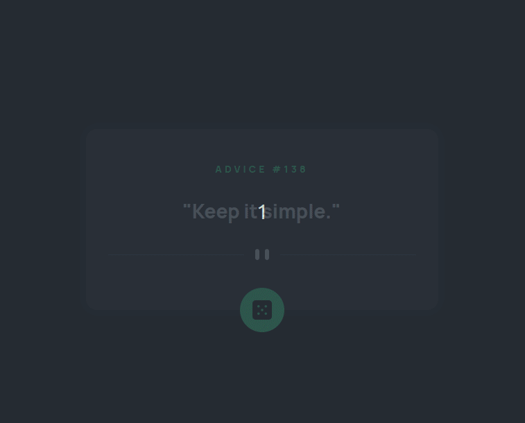

# Advice generator app solution

This is a solution to the [Advice generator app challenge on Frontend Mentor](https://www.frontendmentor.io/challenges/advice-generator-app-QdUG-13db).

## Table of contents

- [Overview](#overview)
  - [The challenge](#the-challenge)
  - [Screenshot](#screenshot)
  - [Links](#links)
- [My process](#my-process)
  - [Built with](#built-with)
  - [What I learned](#what-i-learned)
  - [Continued development](#continued-development)
- [Author](#author)

## Overview

### The challenge

Users should be able to:

- View the optimal layout for the app depending on their device's screen size
- See hover states for all interactive elements on the page
- Generate a new piece of advice by clicking the dice icon

### Screenshot

### Links

- Solution URL: [Solution in FrontendMentor](https://www.frontendmentor.io/challenges/advice-generator-app-QdUG-13db/hub/advice-generator-app-with-nextjs-and-framer-motion-JxNTyPbdV5)
- Live Site URL: [Live site](https://advice-slip-nine.vercel.app/)

## My process

### Built with

- Flexbox
- [React](https://reactjs.org/) - JS library
- [Next.js](https://nextjs.org/) - React framework
- CSS Modules
- Framer Motion
- SWR

### What I learned

I learned that Framer Motion is AMAZING! I've added several nice animations to this project and it was the easiest part.

### Continued development

If kept working on this project, I would improve my handling of the API calls. I don't think my solution using a random index was the best way to avoid the caching of the advices.

**Note: Delete this note and the content within this section and replace with your own plans for continued development.**

## Author

- Website - [Gustavo Santos](https://github.com/gefgu)
- Frontend Mentor - [@gefgu](https://www.frontendmentor.io/profile/gefgu)
- Twitter - [@codewithgustavo](https://www.twitter.com/codewithgustavo)
